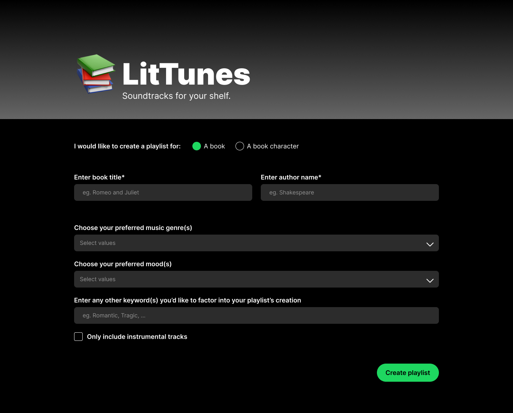
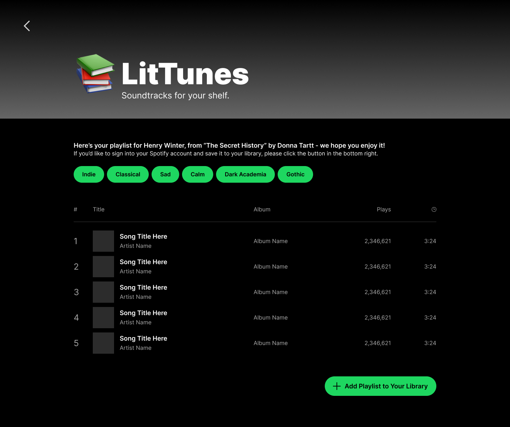
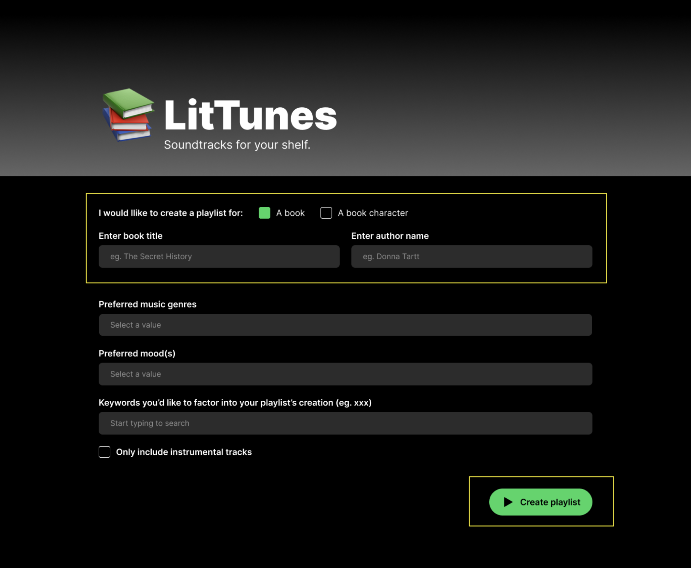
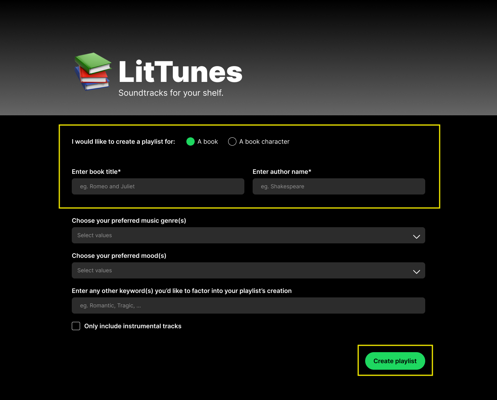

# **FP4 \- Final Project Writeup**

## Part 1: Website Description

LitTunes is an application that creates custom playlists for readers, tailoring song recommendations to suit a specified book or characters using the Spotify API. Users are asked to enter the title of their preferred book, the author's name, and the character name. They are also able to specify particular moods they'd like the tracks to convey, or keywords or phrases they'd like to be factored into the playlist. Songs returned by the app meet one or more of these criteria.

As a life-long reader who has worked in publishing in various respects, and someone who is active in book communities, I know that creating playlists for current or favorite reads is something that many people enjoy doing. I have a few of these playlists myself, and I understand that curating is half of the fun. So, the playlists created by this app are only intended to be used as a starting point.

The site will work best for readers of popular fiction for which playlists have already been created; this is an unfortunate side-effect of the issues encountered with APIs. It would have been preferable to generate playlists organically, as opposed to pulling songs from existing ones, but even so, this site may be treated as a proof of concept for an idea I'd be interested in exploring further.

The current implementation includes use React Redux and React Router, with Material UI and the React Spotify Embed used for components. Given the time, I would like to refine the visuals of the site (as it is presently quite plain), incorporating micro-interactions, animations, and the like. I would also consider reattempting the concept with the Apple Music API, since Spotify's has recently enacted new restrictions that make it difficult make the basis for recommendations more refined.

## Part 2: User Interaction

1. **Click to authenticate user.** On homepage, click on the sign-in button to be directed to a Spotify url for authorization. Once given permission to access user's account, Spotify url will redirect to /form page of app.
2. **Click into form fields.** Click on the various form fields to activate them.
3. **Type in form fields.** The first few form fields require users to type their desired book/character into the specified fields.
4. **Click to select 'mood' from dropdown.** Clicking on the 'mood' field will open the MUI select component, populated with a number of options. Users are able to choose more than one.
5. **Type into 'keyword' field.** Users may type into the 'keyword' field, and hit 'enter' to add the word or phrase.
6. **Click to create playlist.** Clicking on the button in the bottom right of the form will begin the playlist creation. The button will remain disabled until all required fields are completed.
7. **Loading state.** To show that an action is being performed behind the scenes, a simple loading animation is used.
8. **Click to interact with returned tracks.** On the /playlist page, users can click to play tracks, use + to add them to their Liked Songs, or view more options for interfacing with the songs on Spotify.
9. **Click and drag.** Users can click & drag on the slider for each track to scrubt to a certain point in the audio.
10. **Click to save playlist.** If a user wishes to save the entire playlist to their library, they can click the button in the bottom right.
11. **Click into form fields.** Click into form fields in the resulting modal to activate them.
12. T**ype in form fields.** The user should type their desired playlist name & description into the modal's fields.
13. **Click to check checkbox.** Clicking on checkbox sets playlist visibility once it's been saved to user's library; checked = public, unchecked = private.
14. **Click to save or cancel.** User can click on a button to either move ahead with saving their playlist, or quit the action.

## Part 3: External Tool

1. [Spotify Web API](https://developer.spotify.com/documentation/web-api)
   - Spotify is the most popular music streaming app. Because my app logic relies on pre-existing playlists, it makes sense to leverage a widely-used platform.
   - I used the API to authenticate users, search for playlists based on a specified query parameter, retrieve the tracks on those playlists, create a new playlist under a user's account, and save tracks to that playlist.
2. [React Router](https://reactrouter.com/)
   - As my app has only a few pages, using Router was not strictly necessary. I implemented it primarily to gain exposure to the tool, though I do find thinking of a site in terms of "pages" to be familiar enough to be helpful.
   - I used React Router to separate my app into 3 "pages": homepage (/), form page(/form), and playlist page (/playlist).
   - Router simulates the pagination of traditional websites that is familiar to users, creating the appearance and experience of distinct pages.
   - The API provides the data needed for my app to work; it would not be functional without it.
3. [React Redux](https://react-redux.js.org/)
   - Passing values as props and having to lift state up (especially through multiple layers) gets bothersome. Technically, using props instead would not have been that drasting of a difference because the app is so small. However, I know Redux is something that is used widely, and I wanted to gain practical exposure to it.
   - I used Redux to store values I would need on more than on page of the site (eg. user data, book title, book character, playlist tracks).
   - I am able to reference values from my Redux state without the need for props.
4. [Material UI](https://mui.com/material-ui/)
   - When looking for a suitable component library, I wanted one that was somewhat visually similar to Spotify's existing brand. This is highly specific, but I also knew I wanted one with a multi-select component that utilized chips, which are fairly common in Spotify's UI.
   - I used MUI input components (select, text field, autocomplete), as well as dialogs, buttons, and a loading spinner.
   - As is the goal for a design systems, using a set of components creates consistency across a product. It also alleviates the fatigue that comes with needing to code low-level building blocks from scratch, making development more efficient.
5. [React Spotify Embed](https://www.npmjs.com/package/react-spotify-embed)
   - I actually would have much preferred a more customizable embed (allowing me to change the color of the tracks, for instance), but deploying with GitHub pages would have made setting up a backend for the [Web Playback SDK](https://developer.spotify.com/documentation/web-playback-sdk) more complicated and time consuming than advisable for this project.
   - This was installed with npm and imported at the top of the file (PlaylistPage.js) as another component would be
   - Provides a way for the user to interact with the tracks returned for the playlist, as opposed to a static list. Now they can play the tracks right in the app, as well as perform other actions on the player.

## Part 4: Design Iteration

To accommodate the issues I ran into with APIs, I ended up removing the 'Genre' field on the form page, as well as the checkbox for retricting a playlist to instrumental-only tracks.

I thought the loading animation I had included in my protoype was a fun touch, but didn't have the time to implement it. The animation would have added some color, but I think the book recommendation included alongside it added it's own interest as well.

There is also a difference between my prototype and website in the way the resulting playlist is displayed. The original design was made referencing the way Spotify lists tracks in a playlist, but I wound up having to use an embed component to make the track playable. I dislike that the color of these embeds is not customizable; it would have been nice to theme their appearance around the cover of the specified book, but introducing an image to the page alonside the inconsistently colored tracks felt messy.

## Part 5: Implementation Challenge

I first found that the book API I had intended on using was not publically accessible and would only work on localhost; most other services didn't contain the information I needed, or the site that did didn't have APIs of their own.

[On November 27th, Spotify deprecated the API endpoints I needed to make more intricate requests](https://developer.spotify.com/blog/2024-11-27-changes-to-the-web-api); I would no longer be able to search for tracks based on audio features, nor woud I be able to generate recommendations based on predetermined selections. The current logic is much simpler & less personalized than I would have liked, but I believe it presents a decent solution.

## Part 6: Generative AI Use and Reflection

### Usage Experiences by Project Aspects

| Tool Name | Ratings      | design | plan | write code | debug | \_ (other?) |
| :-------- | :----------- | :----- | :--- | :--------- | :---- | :---------- |
| ChatGPT   | Usage        | No     | No   | Yes        | Yes   | N/A         |
| ChatGPT   | Productivity | N/A    | N/A  | 6          | 7     | N/A         |

### Usage Reflection

> Impact on your design and plan

- It matched my expectations and plan in [FP2](#generative-ai-use-plan) in that … For example,
  1. ChatGPT: I expected that I would use the tool primarily for debugging and troubleshooting purposes, which was accurate.
- It did not match my expectations and plan in [FP2](#generative-ai-use-plan) in that … For example,
  1. ChatGPT: Not applicable; I believe I was reasonable in my expectations and had a good understanding of what I would/wouldn't use the tool for.
- GenAI tool did not influence my final design and implementation plan because … For example,
  1. ChatGPT: It didn't have any bearing on the functionality of my website. It moreso served as a means of making the idea come to fruition. The changes that came about as I worked on my project were motivated by forces ouside of GenAI. They were brought about by restrictions in time and the services I sought to leverage, and not outputs from ChatGPT.

> Use patterns

- I accepted the generations when I didn't have enough existing knowledge of the issue to troubleshoot efficiently while unguided. For example,
  1. ChatGPT: I ran into some issues with the authorization step of working with the Spotify API, hadn't made progress through conventional research (StackOverflow, forums, etc.), and didn't know how to proceed. I could see that a token was being returned, but was still receiving errors; ChatGPT proposed that this might be because a request for the token was being made with the authorization code more than once - since codes can't be reused, resulted in an error. It suggested using debouncing and query parameter management to avoid this, forcing a wait time between calls and removing the authorization code from the url after it had been used once. This finally worked! I had seen lodash in passing, but didn't know enough about it to realize it could be of use here.
- I critiqued/evaluated the generated suggestions by considering my particular needs and the context of my project, as well as by making comparisons to best practices I was already aware of.
  1. ChatGPT: When working on getting the user's account data to persist despite page refreshes, the tool suggested that set up an initial loading state in a store folder, use redux-thunk, applyMiddleware, etc. I rejected this suggestion because I knew I had already configured my Redux state in a particular way that didn't include a store folder. redux-thunk and applyMiddleware seemed to be for setting up Redux dev tools, but I had also already done that. I was able to set up an initial loading state without following these extraneous suggestions, because I understood the nuances of my app better than ChatGPT did.
  2. ChatGPT: This tool initially assumed my logic for searching the Spotify API would be kept within the component it was executed in; I made the suggestion that it might be best to break the functions out into a utils file for later importing. This was a method I saw often while working on large projects, and though my app is small, I knew it would probably be a good habit to develop.

> Pros and cons of using GenAI tools

- Pros
  1. ChatGPT: Provided suggestions for problem-solving in areas/with tools I had less experience with
  2. ChatGPT: Can provide starter code that you're then able to build upon
- Cons
  1. ChatGPT: May not entirely grasp the scope or nuances of your particular project, and can provide incorrect/misleading information as a result
  2. ChatGPT: Easy to fall into the trap of seeking quick solutions without understanding them

### Usage Log

I share a ChatGPT account with my mother and sister, and we often end up mixing our chats amongst each other. I also tend to change topics within a single chat. It would be an invasion of thei privacy to share anything that might contain their information, as well as inefficient considering the amount of unrelated things that would be included. Instead, I have listed examples of the questions I have asked below:

1. How does the Spotify web API's client creditentials authorization differ from the authorization code flow? How would I need to alter my current set up to transition to this new approach?
2. I see my authorization code is being received and is successfully exchanged for a token, but there is still an invalid_grant error - why might this be? (This line of questioning was very repetitive, as I tried many suggestions before finding a working solution)
3. How can I make certain values in my Redux state persist through a page refresh?
4. Is there anyway to override the background color set by a track's album art in the React Spotify Embed component? (There isn't, at least not a way that is feasible at the moment)
5. Where should my .env files go in a React project?
6. Can I break these functions out into a separate utils file? (Referring to the functions used to perform the playlist creation logic)

---

# **FP3 \- Final Project Check-in**

Document the changes and progress of your project. How have you followed or changed your implementation & GenAI use plan and why? Remember to commit your code to save your progress.

## Implementation Plan Updates

- Was on largely track with implementation plan at this point
- Able to successfully make calls to Spotify API
- Had mapping of values to be used on user-specified mood, but having difficulties with Hardcover's API
- May have to rethink book API integration aspect of the site

## Generative AI Use Plan Updates

- No updates to Generative AI Use Plan

Remember to keep track of your prompts and usage for [FP4 writeup](#part-6-generative-ai-use-and-reflection).

---

# **FP2 \- Evaluation of the Final project**

## Project Description

**LitTunes** is an application that creates custom playlists for readers, tailoring song recommendations to suit a specified book, characters, or keywords using the Spotify API.

## High-Fi Prototypes

### _Prototype 1_ - Homepage

The Homepage features a form for the user to complete, gathering the information needed to construct their playlist. Participant #2 initially overlooked the radio buttons at the beginning of the form (for choosing between a book and particular character); as is mentioned later, spacing is increased to call more attention to it.

### _Prototype 2_ - Playlist Page

The Playlist Page follows the loading screen; it displays the playlist generated as a result of the user's specifications on the Homepage. Neither of the users had any feedback around this stage of the prototype.

## Usability Test

In my usability test, I first provided the participants with some context as to the purpose of the app, then assigned them their task (the app has a pretty singular purpose, so I only found one task to be necessary). Users were asked to generate a playlist for the character Henry Winter from "The Secret History" by Donna Tartt. The playlist should have the following characteristics:

- It should include the genres Indie and Classical
- It’s moods should be Sad and Calm
- It should be further inspired by the phrases Dark Academia and Gothic
- It may include songs with lyrics

Equipped with this direction, both users were able to successfully complete the task.

Participant #1 did not encounter any difficulty and did not have any visual design feedback. They expressed satisfaction with the app’s performance and appreciated the loading screen and the recommendation it featured. Since the application will be heavily dependent on behind-the-scenes logic for crafting the playlist, it is anticipated that a loading screen lasting a few seconds will be required. The colorful animation and TBR suggestion were added as a way to decrease the user's perceived waiting time, so I'm glad they're able to contribute some value to the user's experience, rather than serve solely as a functional necessity.

Participant #2 did initially overlook the radio buttons at the beginning of the form (for choosing between a book and particular character). It carries less visual weight than larger input fields, so to distinguish it further from the rest of the questions they advised increasing the spacing between it and the following fields. Specifically, they suggested matching the amount of space that is used between the book/author/character fields and the genre/mood/keyword fields. This is feedback that I implemented, as seen in my revised design.

## Updated Designs

Designs were updated to increase spacing in the first section of the form & remove the play icon from the "Create playlist" button.

## Feedback Summary

One of the points of feedback I received from our lab session last week was to consider incorporating colored cards to represent genres and moods instead of a list format. While I do agree this would add visual interest to the page, I don't believe it would be conducive to many items. Spotify's list of genres is extremely extensive, numbering well past 1,000. While I don't (currently) plan to include all of them in my application, I would still like to include more than would be appropriate for cards. Perhaps there is a way to use cards for the most popular/well-known genres and moods, but provide a more condensed format for others. Once I have started looking into the specific components needed for the form, I will decide how to proceed.

Another point of feedback I received was surrounding the "Create playlist" button on my homepage. It was brought up that the inclusion of a play icon prepending the button text might lead to some confusion, since the button submits a form rather than actually plays something. I had initially added the icon for decorative purposes, thinking it would "add something" to an otherwise plain button, but this is a valid point; I have removed the icon from my updated design.

It was also suggested that I might provide an explanation as to why each song was chosen, making clear the connection between the book/character and the generated playlist. I would love to add a feature like this, but I believe it reaches beyond timeframe I have to work with. Getting into the weeds with lyric analysis sounds like a great learning opportunity, but also a time consuming one that wouldn't be doable within the scope of the class.

## Milestones

### _Implementation Plan_

- [ ] Week 9 Oct 28 \- Nov 1:
  - [x] FP1 due
- [ ] Week 10 Nov 4 \- Nov 8:
  - [x] FP2 due
  - [ ] Initial set-up with libraries and frameworks
  - [ ] Obtain credentials for required APIs
  - [ ] Basic form logic for capturing user input
  - [ ] Potentially implement user authentication with Spotify's OAuth
- [ ] Week 11 Nov 11 \- Nov 15:
  - [ ] Create mapping of values such as valence, energy, etc. to moods for use with Spotify's API
  - [ ] Test Hardcover API (or alternative), ensuring content can be located based on user specified title, author and character
  - [ ] Test Spotify API (or alternative), ensuring content can be located based on user specified genres, moods and keywords
- [ ] Week 12 Nov 18 \- Nov 22:
  - [ ] Continue with API integration logic
  - [ ] Determine best way to pick which songs of returned results to include in playlist
- [ ] Week 13 Nov 25 \- Nov 29:

  - [ ] If needed, continue working on API logic
  - [ ] Work on styling, animations, etc.
  - [ ] Thanksgiving

- [ ] Week 14 Dec 2 \- Dec 6:
  - [ ] Last tweaks & bug fixes
  - [ ] FP4 due

### _Libraries and Other Components_

List the JS libraries and other components (if applicable) that you plan to use.

- React.js
- Mantine or Material UI component library
- Redux (maybe just to try it out, probably overkill)

## Generative AI Use Plan

### _Tool Use_

I primarily plan to use ChatGPT over the courrse of the development of my project. My previous experiences in web development and CS education have equipped me to recognize the strengths and limitations of the tool in practical scenarios.

- ChatGPT can serve as a first line of inquiry for troubleshooting common errors and optimizing code snippets. By inputting specific error messages or describing a bug, I can receive suggestions on potential fixes or better practices. This is particularly useful in iterative testing and refining phases, where quick resolutions can accelerate development.
- With my background in teaching for CS, I especially recognize the importance of understanding the fundamentals behind any solution. It is imperative that it be treated as a resource and not a crutch. I will use ChatGPT to supplement my research on new programming concepts or APIs by asking it to explain complex ideas in simpler terms or to provide additional context. This will aid in reinforcing my learning and ensuring a solid foundation for my development work.

I will not use ChatGPT for:

- Final Decision-Making or Complex Problem Solving: While ChatGPT is an excellent tool for generating ideas and providing suggestions, it does not understand the specific context or unique requirements of my project like a human developer would. I will not rely on it for making critical decisions or solving complex problems that require deep understanding of user needs or the specific technical stack of my project.
- Substituting Peer Reviews: GenAI can help spot straightforward issues or inefficiencies in code, but it cannot replace the nuanced feedback provided by human peer reviews. I value insights that come from the perspectives of my peers, particularly those that can challenge my assumptions and encourage creative solutions.

### _Responsible Use_

How would you use Generative AI responsibly?
I will always be aware of the information being fed to a GenAI tool like ChatGPT, particularly as this relates to keys and tokens that are meant to remain secure.
I will also provide oversight at all times, vetting any code that is produced for potentially biased and/or harmful decision-making.

# **FP1 \- Proposal for Critique**

## Idea Sketches

### _LitTunes_

**LitTunes** is an application that creates custom playlists for readers, tailoring song recommendations to suit a specified book, characters, or keywords using the Spotify API.

_Interactivity and Engagement:_ The functionality of the app depends on user participation. Users will have control over several metrics for playlist generation (book title or character name, desired moods, genres, and keywords).

_Accessibility:_ The design will prioritize easy navigation and control. The platform will also strive to abide by [Spotify's accessibility guide for developers](https://developer.spotify.com/documentation/accessibility), maintaining awareness of alt text, color contrast, and more.

_Information:_ Not applicable. LitTunes is not an informational application.

_Left: Prompt page; contains various fields for users to specify their playlist features_
_Right: Playlist generation results; reiteration of playlist features and vertical list of recommended tracks_

### _FableFrame_

**FableFrame** is a tool aimed at helping authors and storytellers organize and visualize the details of their characters and settings, making the manuscript development process more structured and accessible.

_Interactivity and Engagement:_ At it's based level the platform will allow users to create character and setting profiles, with the ability to enter text and add images and links. Future iterations might explore ways to link characters, drag-and-drop functionality, etc.

_Accessibility:_ FableFrame will be designed with a focus on readability and ease of use, possibly including options for changing text size and background colors to accommodate different visual preferences. As a form of a CMS, organization will be key, and the interface will need to be as straightforward as possible.

_Information:_ The information FableFrame showcases depends on content entered by the user, but the interface will at least feature the essential sections for character and setting design. Users will be able to access both general and detail views of their information, reducing information-overload and ensuring only the necessary information is provided at a given time.

_Top Left: Main page; shows sortable/filter-able list of created subpages (characters and settings); navigation panel allows user to access pages specifically for characters or settings_
_Bottom Left: Alternate main page; user can toggle between list and grid view_
_Right: Example of a character page, containing sections dedicated to general information, appearance, personality, etc. Setting pages would be similar, but with different sections._

### _Mealwise_

**Mealwise** is designed to provide users with personalized recipe recommendations and nutritional information by leveraging the [Spoonacular API](https://spoonacular.com/food-api). The project aims to help users discover new meals based on their dietary preferences and what ingredients they have on hand.

_Interactivity and Engagement:_ With the "What's in my fridge" feature, users will be able to input specific ingredientsto receive recipe suggestions, creating a dynamic and personalized experience.

_Accessibility:_ The design will focus on photos and text, screen reader compatibility, and simple, intuitive navigation to ensure that the website is accessible to users with varying abilities.

_Information:_ The site will feature general browsing and a recipe detail view. It will display thorough breakdowns of recipes, including ingredients, cooking steps, nutritional information, and more.

_Top Left: Homepage; choice between general recipe search and searching for recipes with specific ingredients/"What's in my fridge" (in hindsight, would not separate these options, just add filtering to general search)_
_Top Right: General recipe search/browsing page_
_Bottom Left: "What's in my fridge" page; user enters specific ingredients they want recipes for_
_Bottom Right: Recipe page; includes image, name, description, ingredients, steps, etc._

## Feedback Summary

For LitTunes, the feedback generally focused on refining the mechanism of playlist creation to ensure relevance and user engagement. Cella found the initial book-centric playlist idea feasible with the Spotify API. Abby and Sapna were intrigued by customizing playlists based on detailed criteria like keywords or book characteristics. Michael questioned the basis for song recommendations and the functionality for saving playlists. Sanjna cautioned against using "vibes" due to their complexity, suggesting sticking with moods. Kennion favored the idea of recommending lyric-free music to accompany reading, considering it a unique angle that could enhance the reading experience.

FableFrame received suggestions related to enhancing the story development tools and information management. Cella advised considering unique interactions or elements that differentiate it from standard content management systems. Abby viewed it as beneficial for organizational purposes and gaining a high-level view of the narrative. Michael proposed a feature to visualize character connections and prevent out-of-character behaviors, which might be complex but intriguing. Sapna saw its utility for authors and their collaborators, like editors and illustrators. Kennion liked it for practicing information architecture and suggested integrating interactive elements like images and sounds through an LLM API.

For Mealwise, the feedback centered on enhancing user interaction and personalization. Cella suggested incorporating appealing designs, especially around the "what's in my fridge" feature. Abby liked the idea of saving recipes and highlighted the fridge feature, while Michael appreciated the meal recommendation aspect. Sapna found the concept useful for managing leftover ingredients. Sanjna recommended focusing on creating a personal recipe book for users and suggested filtering options to refine recipe searches. Kennion emphasized the potential of integrating an LLM API to explore what could be made from available ingredients, suggesting that this aspect might introduce complexity but could be enjoyable.

## Feedback Digestion

I have decided to develop LitTunes, as I believe it’s the most interactive and interesting project of the three, both for users and myself as the developer.

While there was some concern around using "vibes" as a metric by which users could craft their playlist, I do believe it's doable. A more accurate term would likely be "keywords", which can be searched for in existing playlist titles and descriptions; ["getting" playlists by field is supported by the Spotify API](https://developer.spotify.com/documentation/web-api/reference/get-playlist), and these can then be searched for the specified keyword(s). This added layer of recommendation logic not only seems viable, but also necessary for improving the relevancy of returned songs. I do not expect genre and mood to provide a fine enough filter for ensuring songs have the appropriate message or subject matter.

I especially appreciate Kennion’s point about recommending instrumental songs that could be listened to _while_ reading. That would definitely be a useful setting for users to toggle on and off, depending on their intentions for the playlist and/or personal preference. I'm not someone who listens to music while reading, but can certainly see how lyric-free tracks would be less distracting and potentially more immersive. "Instrumental" is listed as one of Spotify's genres, so this should be fairly simple to filter for.

Michael's question around saving the generated playlist was also something that had crossed my mind but not fully looked into. A quick search shows that [creating an empty playlist for a user](https://developer.spotify.com/documentation/web-api/reference/create-playlist) and [saving tracks to it](https://developer.spotify.com/documentation/web-api/reference/add-tracks-to-playlist) is also possible with the API. To implement this, the user would need to sign into their Spotify account. I wonder if it would be best to have users sign in upfront in order to use the app, or wait until they make the decision to save the playlist to prompt sign-in. An immediate benefit of the second approach would be leaving the playlist-creation aspect of the app accessible to non-Spotify users, but I'll have to give this more thought.
