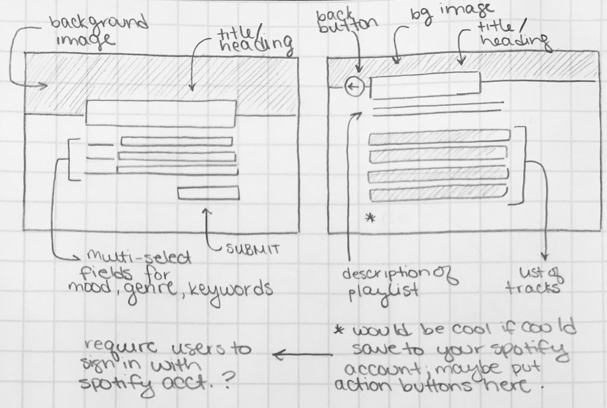
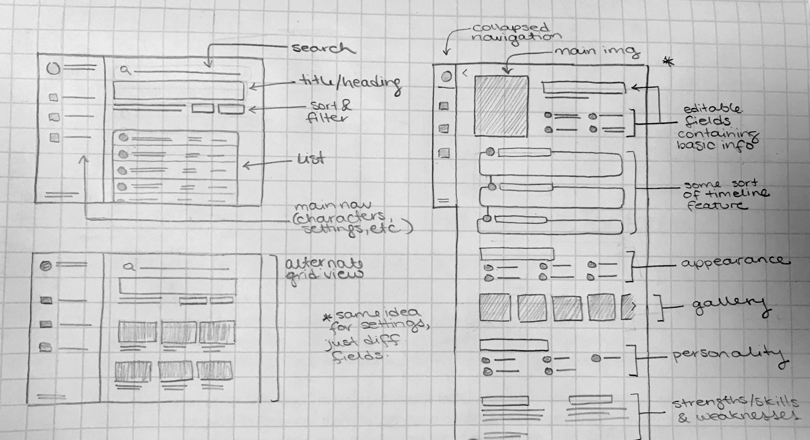
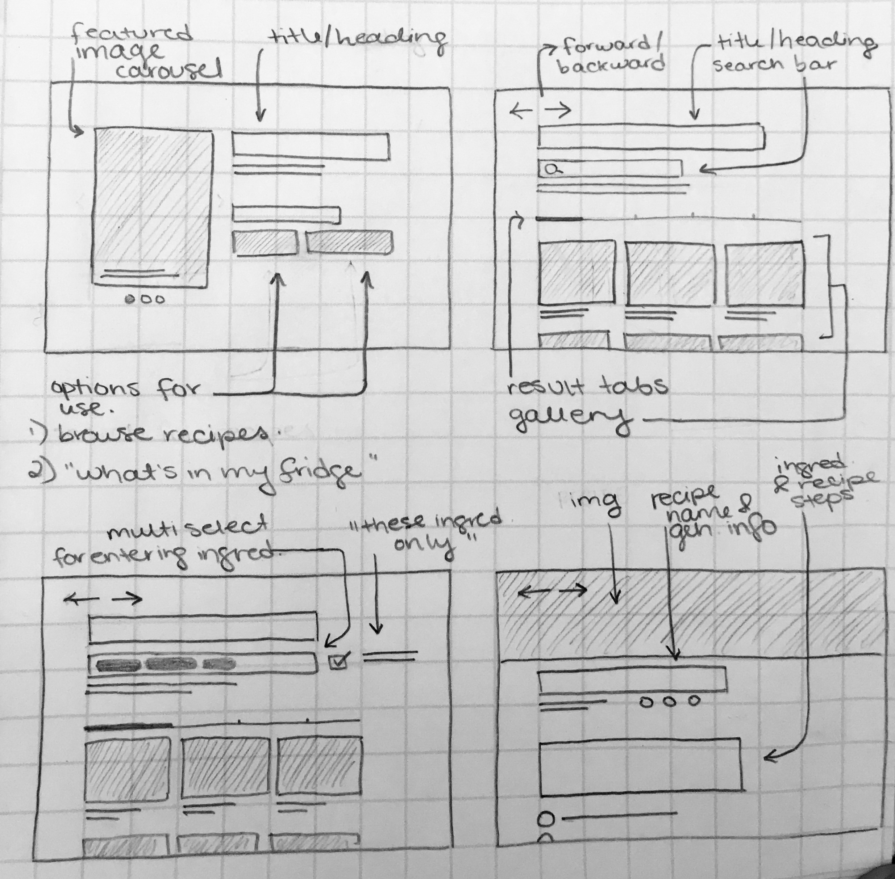

# **FP4 \- Final Project Writeup**

Feel free to refer to this [Markdown Cheat Sheet](https://www.markdownguide.org/cheat-sheet/) to make your writeup more organized, and you can preview your markdown file in VSCode [Markdown editing with Visual Studio Code](https://code.visualstudio.com/docs/languages/markdown#_markdown-preview).

## Part 1: Website Description

Describe your website (300 words).

- What is the purpose of your website?
- Who is the target audience?
- What information do you convey with your website?
- How is it interesting and engaging?

## Part 2: User Interaction

How a user would interact with your website? For each step, briefly but clearly state the interaction type & how we should reproduce it.

1. Interaction type. Click on X on page Y / scroll on page X, etc.
2.

## Part 3: External Tool

Describe what important external tool you used (JavaScript library, Web API, animations, or other). Following the bulleted list format below, reply to each of the prompts.

1. Name of tool1
   - Why did you choose to use it over other alternatives? (2 sentences max)
   - How you used it? (2 sentences max)
   - What does it add to your website? (2 sentences max)
2. Name of tool2

## Part 4: Design Iteration

Describe how you iterated on your prototypes, if at all, including any changes you made to your original design while you were implementing your website and the rationale for the changes. (4-8 sentences max)

## Part 5: Implementation Challenge

What challenges did you experience in implementing your website? (2-4 sentences max)

## Part 6: Generative AI Use and Reflection

Describe how you used Generative AI tools to create this final project (fill in the following information, write \~500 words in total).

Document your use of all GenAI tools — ChatGPT, Copilot, Claude, Cursor, etc. using the template below. Add/Delete rows or bullet points if needed, and replace Tool1/Tool2 with the name of the tool.

### Usage Experiences by Project Aspects

Feel free to edit the column \_ (other?) or add more columns if there's any other aspect in your project you've used the GenAI tools for.

For the following aspects of your project, edit the corresponding table cell to answer:

- _Usage_: Whether you used / did not use this tool for the aspect. Enter [Yes/No]
- _Productivity_: Give a rating on whether this tool makes your productivity for X aspect [1-Much Reduced, 2-Reduced, 3-Slightly Reduced, 4-Not Reduced nor Improved, 5-Slightly Improved, 6-Improved, 7-Much Improved].

| Tool Name | Ratings      | design | plan   | write code | debug  | \_ (other?) |
| :-------- | :----------- | :----- | :----- | :--------- | :----- | :---------- |
| Tool1     | Usage        | Yes/No | Yes/No | Yes/No     | Yes/No | Yes/No      |
| Tool1     | Productivity | 1~7    | 1~7    | 1~7        | 1~7    | 1~7         |
| Tool2     | Usage        | Yes/No | Yes/No | Yes/No     | Yes/No | Yes/No      |
| Tool2     | Productivity | 1~7    | 1~7    | 1~7        | 1~7    | 1~7         |

### Usage Reflection

> Impact on your design and plan

- It matched my expectations and plan in [FP2](#generative-ai-use-plan) in that … For example,
  1. Tool1:
  2. Tool2:
- It did not match my expectations and plan in [FP2](#generative-ai-use-plan) in that … For example,
  1. Tool1:
  2. Tool2:
- GenAI tool did/did not influence my final design and implementation plan because … For example,
  1. Tool1:
  2. Tool2:

> Use patterns

- I accepted the generations when … For example,
  1. Tool1: this tool once suggested … and I adjusted my design according to the suggestion because …
  2. Tool2:
- I critiqued/evaluated the generated suggestions by … For example,
  1. Tool1: this tool once suggested … but I modified/rejected the suggestion because …
  2. Tool2:

> Pros and cons of using GenAI tools

- Pros
  1. Tool1:
  2. Tool2:
- Cons
  1. Tool1:
  2. Tool2:

### Usage Log

Document the usage logs (prompts and chat history links) for the GenAI tools you used. Some tools may not have an easy way to share usage logs, just try your best! Some instructions for different tools:

1. [ChatGPT](https://help.openai.com/en/articles/7925741-chatgpt-shared-links-faq) / [Gemini](https://support.google.com/gemini/answer/13743730?hl=en&co=GENIE.Platform%3DDesktop): share the anonymous link to all of your chat histories relevant to this project
2. [GitHub Copilot (VSCode)](<https://code.visualstudio.com/docs/copilot/copilot-chat#:~:text=You%20can%20export%20all%20prompts%20and%20responses%20for%20a%20chat%20session%20in%20a%20JSON%20file%20with%20the%20Chat%3A%20Export%20Session...%20command%20(workbench.action.chat.export)%20in%20the%20Command%20Palette.>): export chat histories relevant to this project.

---

# **FP3 \- Final Project Check-in**

Document the changes and progress of your project. How have you followed or changed your implementation & GenAI use plan and why? Remember to commit your code to save your progress.

## Implementation Plan Updates

- [ ] ...

## Generative AI Use Plan Updates

- [ ] ...

Remember to keep track of your prompts and usage for [FP4 writeup](#part-6-generative-ai-use-and-reflection).

---

# **FP2 \- Evaluation of the Final project**

## Project Description

Briefly restate your motivation and a short description of your project.

## High-Fi Prototypes

### _Prototype 1_

A brief description and summary of the user feedback (\<100 words, 2 images)

### _Prototype 2_

…

## Usability Test

Discuss the user feedback you got during the evaluation / usability test (\~300 words). Indicate which feedback you implemented, inspired new directions, or otherwise influenced your final design.

## Updated Designs

Show screenshots of your updated design based on the user feedback (\<100 words, \~2 images).

## Feedback Summary

Summarize the feedback you received in the lab session and discuss how it influenced your design (\~300 words).

## Milestones

Outline weekly milestones to plan your expected implementation progress until the end of the semester (\~300 words).

### _Implementation Plan_

- [ ] Week 9 Oct 28 \- Nov 1:
  - [x] FP1 due
  - [ ] ...
- [ ] Week 10 Nov 4 \- Nov 8:

  - [ ] FP2 due

- [ ] Week 11 Nov 11 \- Nov 15:
- [ ] Week 12 Nov 18 \- Nov 22:
- [ ] Week 13 Nov 25 \- Nov 29:

  - [ ] Thanksgiving

- [ ] Week 14 Dec 2 \- Dec 6:
  - [ ] FP4 due

### _Libraries and Other Components_

List the JS libraries and other components (if applicable) that you plan to use.

-

## Generative AI Use Plan

Outline how you plan to use Generative AI tools to aid in the implementation (\~300 words).

### _Tool Use_

What would you use? Edit the list given your plan. For each tool, explain briefly on what do you expect Generative AI to help you with and what might it not be able to help you with.

- ChatGPT
  - I will use it for … because it can help me …
  - I will not use it for … because it might not be able to help me with …
- GitHub Copilot
- ...

### _Responsible Use_

How would you use Generative AI responsibly?

---

# **FP1 \- Proposal for Critique**

## Idea Sketches

### _LitTunes_

**LitTunes** is an application that creates custom playlists for readers, tailoring song recommendations to suit a specified book, characters, or keywords using the Spotify API.

_Interactivity and Engagement:_ The functionality of the app depends on user participation. Users will have control over several metrics for playlist generation (book title or character name, desired moods, genres, and keywords).

_Accessibility:_ The design will prioritize easy navigation and control. The platform will also strive to abide by [Spotify's accessibility guide for developers](https://developer.spotify.com/documentation/accessibility), maintaining awareness of alt text, color contrast, and more.

_Information:_ Not applicable. LitTunes is not an informational application.

_Left: Prompt page; contains various fields for users to specify their playlist features_
_Right: Playlist generation results; reiteration of playlist features and vertical list of recommended tracks_

### _FableFrame_

**FableFrame** is a tool aimed at helping authors and storytellers organize and visualize the details of their characters and settings, making the manuscript development process more structured and accessible.

_Interactivity and Engagement:_ At it's based level the platform will allow users to create character and setting profiles, with the ability to enter text and add images and links. Future iterations might explore ways to link characters, drag-and-drop functionality, etc.

_Accessibility:_ FableFrame will be designed with a focus on readability and ease of use, possibly including options for changing text size and background colors to accommodate different visual preferences. As a form of a CMS, organization will be key, and the interface will need to be as straightforward as possible.

_Information:_ The information FableFrame showcases depends on content entered by the user, but the interface will at least feature the essential sections for character and setting design. Users will be able to access both general and detail views of their information, reducing information-overload and ensuring only the necessary information is provided at a given time.

_Top Left: Main page; shows sortable/filter-able list of created subpages (characters and settings); navigation panel allows user to access pages specifically for characters or settings_
_Bottom Left: Alternate main page; user can toggle between list and grid view_
_Right: Example of a character page, containing sections dedicated to general information, appearance, personality, etc. Setting pages would be similar, but with different sections._

### _Mealwise_

**Mealwise** is designed to provide users with personalized recipe recommendations and nutritional information by leveraging the Spoonacular API. The project aims to help users discover new meals based on their dietary preferences and what ingredients they have on hand.

_Interactivity and Engagement:_ With the "What's in my fridge" feature, users will be able to input specific ingredientsto receive recipe suggestions, creating a dynamic and personalized experience.

_Accessibility:_ The design will focus on photos and text, screen reader compatibility, and simple, intuitive navigation to ensure that the website is accessible to users with varying abilities.

_Information:_ The site will feature general browsing and a recipe detail view. It will display thorough breakdowns of recipes, including ingredients, cooking steps, nutritional information, and more.

_Top Left: Homepage; choice between general recipe search and searching for recipes with specific ingredients/"What's in my fridge" (in hindsight, would not separate these options, just add filtering to general search)_
_Top Right: General recipe search/browsing page_
_Bottom Left: "What's in my fridge" page; user enters specific ingredients they want recipes for_
_Bottom Right: Recipe page; includes image, name, description, ingredients, steps, etc._

## Feedback Summary

For LitTunes, the feedback generally focused on refining the mechanism of playlist creation to ensure relevance and user engagement. Cella found the initial book-centric playlist idea feasible with the Spotify API. Abby and Sapna were intrigued by customizing playlists based on detailed criteria like keywords or book characteristics. Michael questioned the basis for song recommendations and the functionality for saving playlists. Sanjna cautioned against using "vibes" due to their complexity, suggesting sticking with moods. Kennion favored the idea of recommending lyric-free music to accompany reading, considering it a unique angle that could enhance the reading experience.

FableFrame received suggestions related to enhancing the story development tools and information management. Cella advised considering unique interactions or elements that differentiate it from standard content management systems. Abby viewed it as beneficial for organizational purposes and gaining a high-level view of the narrative. Michael proposed a feature to visualize character connections and prevent out-of-character behaviors, which might be complex but intriguing. Sapna saw its utility for authors and their collaborators, like editors and illustrators. Kennion liked it for practicing information architecture and suggested integrating interactive elements like images and sounds through an LLM API.

For Mealwise, the feedback centered on enhancing user interaction and personalization. Cella suggested incorporating appealing designs, especially around the "what's in my fridge" feature. Abby liked the idea of saving recipes and highlighted the fridge feature, while Michael appreciated the meal recommendation aspect. Sapna found the concept useful for managing leftover ingredients. Sanjna recommended focusing on creating a personal recipe book for users and suggested filtering options to refine recipe searches. Kennion emphasized the potential of integrating an LLM API to explore what could be made from available ingredients, suggesting that this aspect might introduce complexity but could be enjoyable.

## Feedback Digestion

I have decided to develop LitTunes, as I believe it’s the most interactive and interesting project of the three, both for users and myself as the developer.

While there was some concern around using "vibes" as a metric by which users could craft their playlist, I do believe it's doable. A more accurate term would likely be "keywords", which can be searched for in existing playlist titles and descriptions; ["getting" playlists by field is supported by the Spotify API](https://developer.spotify.com/documentation/web-api/reference/get-playlist), and these can then be searched for the specified keyword(s). This added layer of recommendation logic not only seems viable, but also necessary for improving the relevancy of returned songs. I do not expect genre and mood to provide a fine enough filter for ensuring songs have the appropriate message or subject matter.

I especially appreciate Kennion’s point about recommending instrumental songs that could be listened to _while_ reading. That would definitely be a useful setting for users to toggle on and off, depending on their intentions for the playlist and/or personal preference. I'm not someone who listens to music while reading, but can certainly see how lyric-free tracks would be less distracting and potentially more immersive. "Instrumental" is listed as one of Spotify's genres, so this should be fairly simple to filter for.

Michael's question around saving the generated playlist was also something that had crossed my mind but not fully looked into. A quick search shows that [creating an empty playlist for a user](https://developer.spotify.com/documentation/web-api/reference/create-playlist) and [saving tracks to it](https://developer.spotify.com/documentation/web-api/reference/add-tracks-to-playlist) is also possible with the API. To implement this, the user would need to sign into their Spotify account. I wonder if it would be best to have users sign in upfront in order to use the app, or wait until they make the decision to save the playlist to prompt sign-in. An immediate benefit of the second approach would be leaving the playlist-creation aspect of the app accessible to non-Spotify users, but I'll have to give this more thought.
